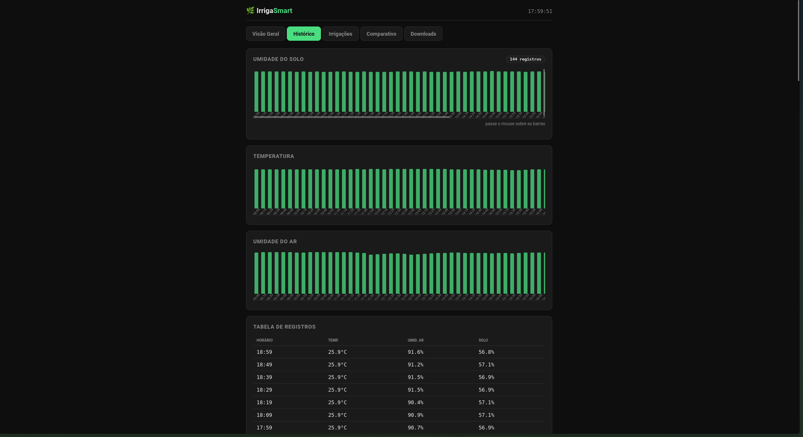

# 🌱 Vaso Inteligente — Irrigação Automática com ESP32

Sistema embarcado de irrigação automatizada que monitora umidade do solo, temperatura e umidade do ar em tempo real, decidindo de forma autônoma quando irrigar uma planta — eliminando o erro humano no processo de rega.

Projeto acadêmico desenvolvido para a disciplina de **IoT / Sistemas Embarcados** — IFPE Campus Palmares.

---

## 📋 Sumário

- [Sobre o projeto](#-sobre-o-projeto)
- [Funcionalidades](#-funcionalidades)
- [Arquitetura e Componentes](#-arquitetura-e-componentes)
- [Esquema de Ligação](#-esquema-de-ligação)
- [Como o código funciona](#-como-o-código-funciona)
- [Dashboard Web](#-dashboard-web)
- [Instalação](#-instalação)
- [API / Endpoints](#-api--endpoints)
- [Limitações e melhorias futuras](#-limitações-e-melhorias-futuras)
- [Autor](#-autor)

---

## 🎯 Sobre o projeto

Plantas domésticas frequentemente morrem por **erro humano no processo de irrigação** — seja por excesso de água (apodrecimento da raiz) ou falta de água (desidratação). O *Vaso Inteligente* resolve esse problema substituindo o "achismo" por decisões baseadas em dados reais, lidos diretamente do ambiente.

O sistema roda em um **ESP32**, que além de controlar os sensores e a bomba, hospeda seu próprio **dashboard web** — permitindo acompanhar tudo em tempo real pelo navegador, de qualquer dispositivo na mesma rede Wi-Fi.

---

## ⚙️ Funcionalidades

- ✅ Leitura contínua da umidade do solo (sensor capacitivo)
- ✅ Leitura de temperatura e umidade do ar (DHT22)
- ✅ Irrigação automática via bomba + relé, com lógica **adaptativa** (não apenas um limite fixo)
- ✅ Bloqueio de segurança em temperaturas extremas
- ✅ Dashboard web em tempo real, hospedado no próprio ESP32
- ✅ Controle manual da bomba via navegador (ligar/desligar)
- ✅ Atualização dos dados a cada 1 segundo, sem bloquear o sistema (non-blocking)

---

## 🧩 Arquitetura e Componentes

| Componente | Função | Pino |
|---|---|---|
| **ESP32 DevKit V1** | Microcontrolador principal + Wi-Fi | — |
| **DHT22** | Temperatura e umidade do ar | GPIO 33 |
| **Sensor de solo capacitivo** | Umidade da terra (0–100%) | GPIO 34 (analógico) |
| **Módulo relé 5V (1 canal)** | Aciona a bomba d'água | GPIO 26 |
| **Mini bomba d'água 3–5V DC** | Realiza a irrigação | via relé (NO/COM) |

### Diagrama de fluxo

```
┌─────────────┐     ┌─────────────┐
│  Sensor de  │     │    DHT22    │
│    Solo     │     │ (Temp/Umid) │
└──────┬──────┘     └──────┬──────┘
       │                   │
       └─────────┬─────────┘
                  ▼
           ┌─────────────┐
           │    ESP32    │
           │  (decisão)  │
           └──────┬──────┘
                  │
        ┌─────────┴─────────┐
        ▼                   ▼
  ┌──────────┐      ┌───────────────┐
  │   Relé   │      │  Dashboard    │
  │  + Bomba │      │  Web (HTTP)   │
  └──────────┘      └───────────────┘
```

---

## 🔌 Esquema de Ligação

| De | Para | Observação |
|---|---|---|
| DHT22 VCC | ESP32 3V3 | |
| DHT22 DATA | ESP32 GPIO 33 | Pull-up interno ativado via software |
| DHT22 GND | ESP32 GND | |
| Sensor Solo VCC | ESP32 3V3 | |
| Sensor Solo AOUT | ESP32 GPIO 34 | Entrada analógica (input-only) |
| Sensor Solo GND | ESP32 GND | |
| Relé VCC | ESP32 VIN (5V) | Bobina do relé precisa de 5V |
| Relé IN | ESP32 GPIO 26 | Sinal de controle (3.3V) |
| Relé GND | ESP32 GND | |
| Relé COM | Fonte externa 5V (+) | Alimentação independente da bomba |
| Relé NO | Bomba (+) | Fecha o contato quando ativa |
| Bomba (−) | Fonte externa GND | **GND comum com o ESP32 é obrigatório** |

> ⚠️ **Atenção:** a bomba exige alimentação externa (ex: 4x pilha AA ou fonte 5V), pois o ESP32 não fornece corrente suficiente via USB. O **GND da fonte externa deve ser conectado ao GND do ESP32** para o circuito funcionar corretamente.

---

## 🧠 Como o código funciona

A lógica de decisão **não usa apenas um limite fixo de umidade** — ela se adapta às condições ambientais:

```cpp
limiar = UMIDADE_MINIMA; // 40% por padrão

if (temperatura > 30°C)      limiar *= 1.10;  // mais calor → solo precisa estar mais úmido
if (umidadeAr > 80%)         limiar *= 0.70;  // ar úmido → planta perde menos água, rega menos

bloquadoPorTemperatura = temperatura > 35°C;   // bloqueio de segurança

if (!bloquadoPorTemperatura && umidadeSolo < limiar) {
  ligarBomba(); // por 5 segundos
}
```

### Por que bloquear acima de 35°C?

1. **Choque térmico na raiz** — água fria em solo muito quente estressa a planta
2. **Desperdício por evaporação** — boa parte da água evapora antes de ser absorvida
3. **Planta já em estresse térmico** — evita adicionar mais uma variável de estresse

O bloqueio é **reavaliado a cada leitura (1 segundo)**, não é permanente. Assim que a temperatura volta abaixo de 35°C, o sistema retoma a irrigação normalmente caso o solo ainda esteja seco.

> **Limitação conhecida:** em um sistema profissional, o ideal seria *adiar* a irrigação para um horário mais ameno (manhã/noite) em vez de bloqueá-la totalmente. Essa é uma simplificação proposital para o escopo do projeto — ver [melhorias futuras](#-limitações-e-melhorias-futuras).

### Execução não-bloqueante

O `loop()` usa `millis()` em vez de `delay()`, permitindo que o servidor web continue respondendo enquanto a bomba está ligada ou enquanto o sistema aguarda o próximo ciclo de leitura.

---

## 🌐 Dashboard Web

O ESP32 hospeda uma página web acessível pelo IP local (ex: `http://192.168.0.15`), exibindo:

- Umidade do solo + limiar atual calculado
- Temperatura e umidade do ar
- Status da bomba (ligada/desligada)
- Alertas de bloqueio por temperatura ou redução por umidade do ar
- Botões para ligar/desligar a bomba manualmente

A página se atualiza automaticamente a cada 2 segundos via `fetch()` em JavaScript, sem necessidade de recarregar.

### 📸 Screenshots

**Visão Geral** — leituras em tempo real e controle manual da bomba


**Histórico** — gráficos de umidade do solo, temperatura e umidade do ar ao longo do tempo



**Irrigações** — log de todos os eventos de irrigação, com umidade antes/depois e tipo (manual/automática)


**Comparativo** — estimativa de litros economizados em relação à irrigação manual


**Downloads** — exportação dos dados em CSV (histórico, eventos e estatísticas)


---

## 🚀 Instalação

### Pré-requisitos
- [Arduino IDE](https://www.arduino.cc/en/software) com suporte a placas ESP32
- Bibliotecas: `WiFi.h`, `WebServer.h` (nativas), `DHT sensor library` (Adafruit)

### Passos

1. Clone o repositório:
   ```bash
   git clone https://github.com/seu-usuario/vaso-inteligente.git
   ```
2. Abra o arquivo `.ino` na Arduino IDE
3. Configure o nome e senha do seu Wi-Fi:
   ```cpp
   const char* WIFI_SSID = "SEU_WIFI";
   const char* WIFI_PASS = "SUA_SENHA";
   ```
4. Selecione a placa **ESP32 Dev Module** e a porta correta
5. Faça o upload do código
6. Abra o **Serial Monitor** (115200 baud) e copie o IP exibido
7. Acesse esse IP no navegador, na mesma rede Wi-Fi

---

## 📡 API / Endpoints

| Rota | Método | Descrição |
|---|---|---|
| `/` | GET | Retorna o dashboard HTML |
| `/api/dados` | GET | Retorna JSON com todas as leituras atuais |
| `/api/bomba/ligar` | GET | Liga a bomba manualmente |
| `/api/bomba/desligar` | GET | Desliga a bomba manualmente |

**Exemplo de resposta de `/api/dados`:**
```json
{
  "temperatura": 27.5,
  "umidadeAr": 65.0,
  "umidadeSolo": 32.4,
  "limiar": 40.0,
  "bombaLigada": false,
  "bloquadoPorTemperatura": false,
  "reducaoPorHumidade": false,
  "valorSeco": 2800,
  "valorUmido": 1400,
  "umidadeMinima": 40
}
```

---

## 🔮 Limitações e melhorias futuras

- [ ] Adiar irrigação em vez de bloquear (usando RTC para agendar horários mais amenos)
- [ ] Alertas via Telegram quando o solo estiver crítico
- [ ] Suporte a múltiplos vasos com dashboard centralizado (MQTT)
- [ ] Histórico de leituras (gráficos ao longo do tempo)
- [ ] Calibração automática do sensor de solo (auto-ajuste de `VALOR_SECO`/`VALOR_UMIDO`)
- [ ] Versão com LoRa para uso em campo aberto / agricultura familiar

---

## 👤 Autor

**Lucas** — IFPE Campus Palmares
Curso: Análise e Desenvolvimento de Sistemas (ADS)
Disciplina: IoT / Sistemas Embarcados

---

## 📄 Licença

Projeto acadêmico de uso livre para fins educacionais.
